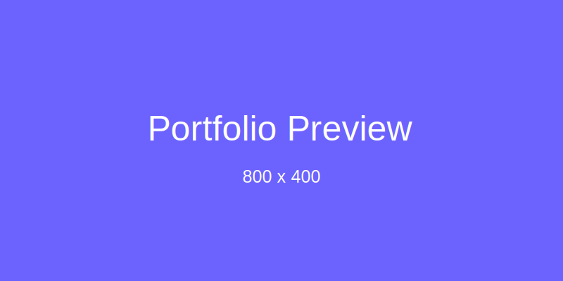

# Portofolio Website

Website portofolio statis yang dibuat dengan HTML, CSS, dan JavaScript. Proyek ini menampilkan template portofolio profesional dengan desain modern dan responsif.



## Fitur

- Desain modern dan responsif
- Animasi smooth scroll
- Efek typing pada hero section
- Portfolio filtering
- Cursor kustom yang mengikuti pointer mouse
- Navbar sticky saat scroll
- Formulir kontak interaktif
- Tampilan mobile-friendly
- Tema yang konsisten
- Gambar placeholder SVG (tidak perlu gambar eksternal)

## Teknologi yang Digunakan

- HTML5
- CSS3 (Flexbox, Grid, dan Animasi)
- JavaScript (ES6+)
- Font Awesome untuk ikon
- Google Fonts
- SVG untuk gambar placeholder

## Cara Menggunakan

1. Clone repository ini
   ```
   git clone https://github.com/AlanEtt/sembarangRepo.git
   ```
2. Buka file `index.html` di browser Anda
3. Sesuaikan konten dengan informasi Anda sendiri

## Struktur Proyek

```
├── index.html          # File HTML utama
├── css/
│   └── style.css       # File CSS utama
├── js/
│   └── script.js       # File JavaScript utama
└── img/                # Folder untuk menyimpan gambar SVG
    ├── profile.svg     # Gambar profil placeholder
    ├── about.svg       # Gambar tentang placeholder
    ├── portfolio-*.svg # Gambar portofolio placeholder
    └── preview.svg     # Gambar preview placeholder
```

## Kustomisasi

Anda dapat menyesuaikan portofolio ini dengan:

1. Mengganti teks dan informasi dengan data Anda sendiri
2. Mengubah gambar SVG di folder `img/` atau ganti dengan gambar Anda sendiri
3. Mengubah warna tema dengan mengedit variabel CSS di `style.css`
4. Menambahkan proyek baru di bagian portofolio

## Perbaikan Bug

Website ini menggunakan gambar SVG placeholder untuk memastikan tampilan yang baik tanpa perlu mengunduh gambar eksternal. Kode JavaScript juga telah dioptimalkan untuk:

1. Menghindari error yang terkait dengan elemen yang tidak ditemukan
2. Memperbaiki konflik nama class `.cursor` untuk cursor kustom dan efek typing
3. Pengecekan elemen sebelum mengakses properti atau metodenya
4. Pemanggilan fungsi animasi pada saat dokumen dimuat

## Lisensi

Proyek ini tersedia dengan lisensi MIT - lihat file LICENSE untuk detail.

## Kredit

Dibuat dengan ❤️ oleh [Nama Anda](https://github.com/AlanEtt) 